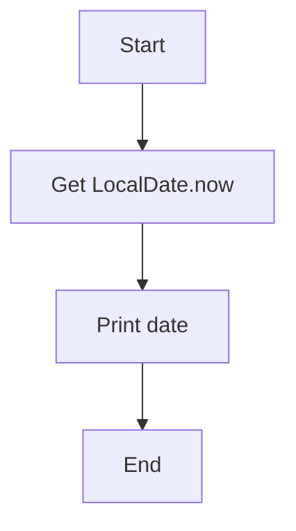

# Java Date & Time Exercises — Algorithms, Pseudocode & Flowcharts

## Exercises

### Exercise 1 — Current LocalDate

### Algorithm

- Access the system’s current date.

- Store it in a LocalDate variable.

- Print the date.

### Pseudocode
```pgsql
Start

date ← LocalDate.now()

print(date)

End
```

### Flowchart 


