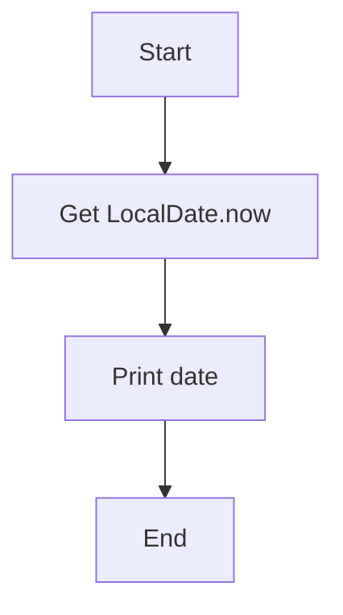

# Java Date & Time Exercises — Algorithms, Pseudocode & Flowcharts

## Exercises

### Exercise 1 — Current LocalDate
Create a LocalDate of the current day and print it out

### Algorithm

- Access the system’s current date.

- Store it in a LocalDate variable.

- Print the date.

### Pseudocode
```pgsql
Start

date ← LocalDate.now()

print(date)

End
```

### Flowchart 




Exercise 2 — Current Date with Formatter
Algorithm

Get today’s LocalDate.

Create a DateTimeFormatter with pattern "EEEE d MMMM".

Format the date.

Print the formatted value.

Pseudocode
date ← LocalDate.now()
formatter ← DateTimeFormatter("EEEE d MMMM")
formatted ← date.format(formatter)
print(formatted)

Flowchart
flowchart TD
A[Start] --> B[Get LocalDate.now()]
B --> C[Create formatter]
C --> D[Format date]
D --> E[Print formatted date]
E --> F[End]
