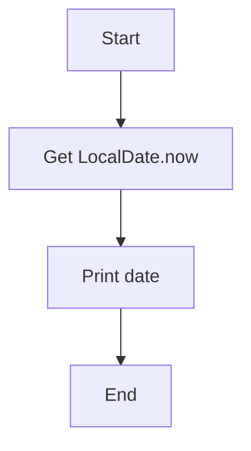
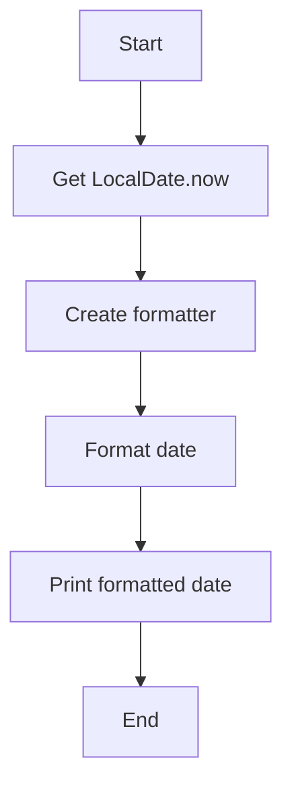
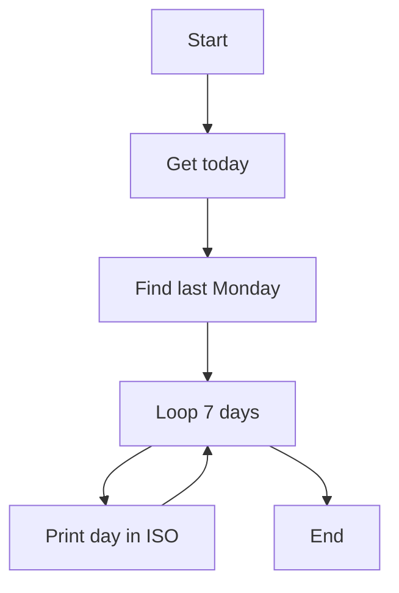
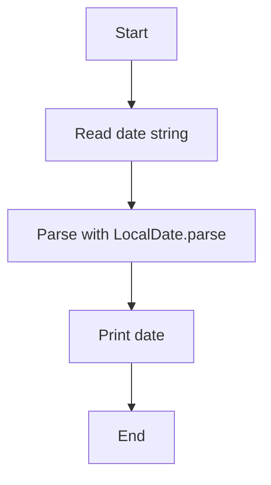
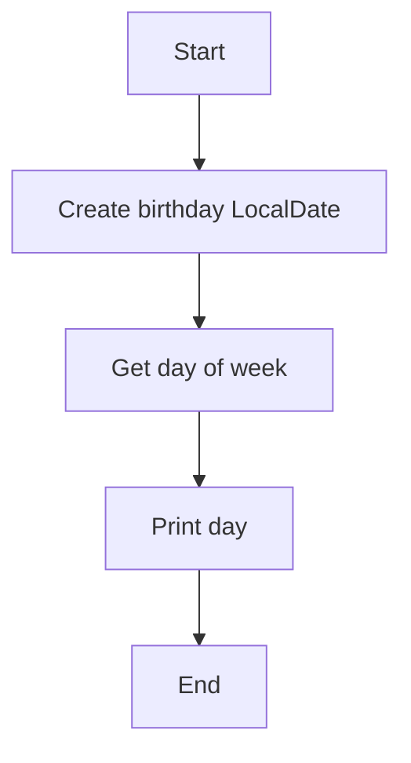
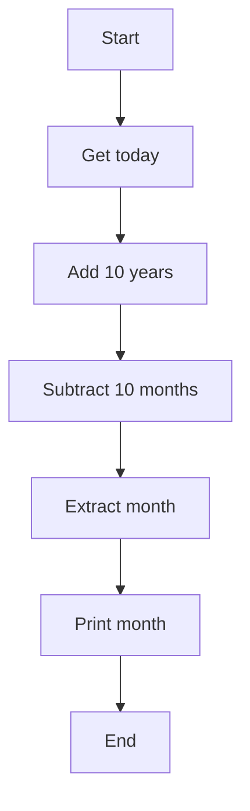

# Java Date & Time Exercises — Algorithms, Pseudocode & Flowcharts

## Exercises

### Exercise 1 — Current LocalDate
### Question: Create a LocalDate of the current day and print it out

### Algorithm

- Access the system’s current date.

- Store it in a `LocalDate` variable.

- Print the date.

### Pseudocode
```pgsql
Start

Date ← LocalDate.now()

Print(date)

End
```

### Flowchart 




### Exercise 2 — Current Date with Formatter

### Question:  
Create a LocalDate of the current day and print it out in the following pattern using
DateTimeFormatter: Torsdag 29 mars

### Algorithm

- Get today’s LocalDate.

- Create a DateTimeFormatter with pattern "EEEE d MMMM".

- Format the date.

- Print the formatted value.

### Pseudocode
```pgsql
Start
Date ← LocalDate.now()
Formatter ← DateTimeFormatter ("EEEE d MMMM")
Formatted ← date.format(formatter)
Print(formatted)
End
```

### Flowchart


### Exercise 3 — Last Monday + Print Entire Week

### Question: 
Create a LocalDate of last Monday. Then print out the entire week in a loop using standard ISO
format.

### Algorithm
  
- Get today’s date.

- Adjust to previous or same Monday.

- Loop 7 times:

- Print the date in ISO format.

- Move to next day.

### Pseudocode

```pgsql
Start 
Today ← LocalDate.now()
Monday ← today.with(previousOrSame(MONDAY))

for i from 0 to 6:
    print(monday.plusDays(i))
```

### Flowchart


### Exercise 4 — LocalDate.parse()

### Question: 
Create a LocalDate object from a String by using the .parse() method 

### Algorithm

- Create a date string.

- Convert to LocalDate using .parse().

- Print the result.

### Pseudocode
```pgsql
Start
DateString ← "2020-05-10"
Date ← LocalDate.parse(dateString)
Print(date)
End
```

### Flowchart



### Exercise 5 — Birthday → Day of Week

### Question: 
The date time api provides enums for time units such as day and month.
Create a LocalDate of your birthday and extract the day of week for that date.
Ex. 1945-05-08 -> TUESDAY

### Algorithm

- Create LocalDate of birth.

- Extract day of week.

- Print it.

### Pseudocode

```pgsql
Start
Birthday ← LocalDate.of(YYYY, MM, DD)
Day ← birthday.getDayOfWeek()
Print(day)
End
```

### Flowchart



### Exercise 6 — Date +10 years –10 months

### Question: 
Create a LocalDate of current date plus 10 years and minus 10 months. From that date extract the
month and print it out

### Algorithm

- Get current date.

- Add 10 years.

- Subtract 10 months.

- Extract month.

- Print month.

### Pseudocode

```pgsql
Start
Date ← LocalDate.now()
NewDate ← date.plusYears(10).minusMonths(10)
Month ← newDate.getMonth()
Print(month)
End
```

### Flowchart




